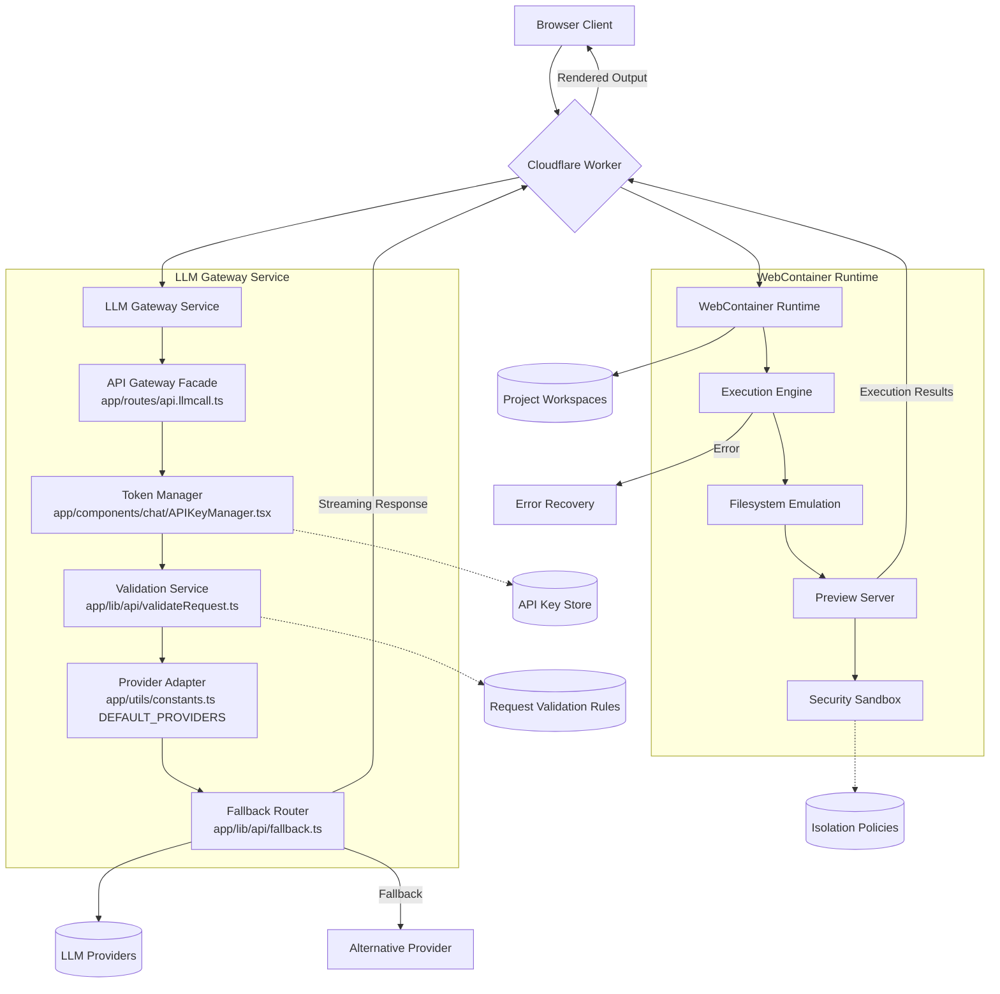

# System Architecture

## Core Components

### Chat Interface System
- **Location**: `app/components/chat/*`
- Responsibilities:
  - Real-time AI chat functionality
  - Multi-provider LLM integration (OpenAI, Anthropic, HuggingFace, etc.)
  - Code execution visualization via WebContainer
  - Session state management

### WebContainer Runtime
- **Location**: `app/lib/webcontainer`
- Key Features:
  - Secure code execution environment
  - Browser-based IDE integration
  - Real-time preview capabilities
  - Filesystem emulation for project workspaces

### LLM Gateway Service
- **Location**: `app/routes/api.llmcall.ts`
- Architecture:
  - Unified API facade for multiple providers
  - Token management via `APIKeyManager.tsx`
  - Streaming response handling
  - Fallback mechanisms for model availability

## Infrastructure


## Data Flow
1. User input processed through `Chat.client.tsx`
2. Request routed via `api.llmcall.ts` to appropriate LLM
3. Code responses executed in WebContainer runtime
4. Results streamed back through `Messages.client.tsx`

## Implementation Details

### Provider Integrations
- **Icon Management**: SVG assets in `public/icons/` mapped to LLM providers (see `public/icons/OpenAI.svg` example)
- **Type Definitions**: `app/types/model.ts` defines ProviderConfiguration interface
- **Configuration**: `app/utils/constants.ts` contains DEFAULT_PROVIDERS array
- **API Contracts**: `app/types/actions.ts` defines LLMRequest/Response types
- **Security**: `app/lib/api/validateRequest.ts` handles request authentication

### API Contracts
```ts
// From app/types/actions.ts
interface LLMRequest {
  provider: string;
  model: string;
  messages: ChatMessage[];
  temperature: number;
}

// From app/routes/api.llmcall.ts
export const loader: LoaderFunction = async ({ request }) => {
  const payload = await validateRequest(request);
  return handleLLMCall(payload);
};
```

### Security Architecture
- API key management via `app/components/chat/APIKeyManager.tsx`
- Request validation in `app/lib/api/validateRequest.ts`
- WebContainer isolation policies in `app/lib/webcontainer/`
